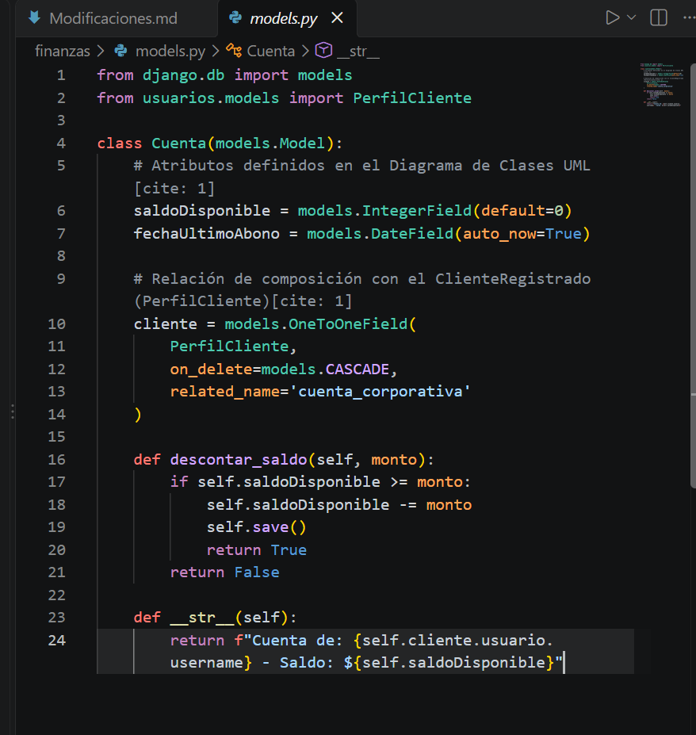
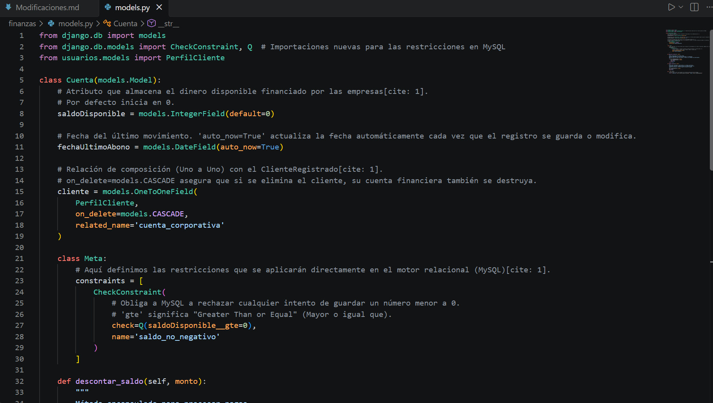
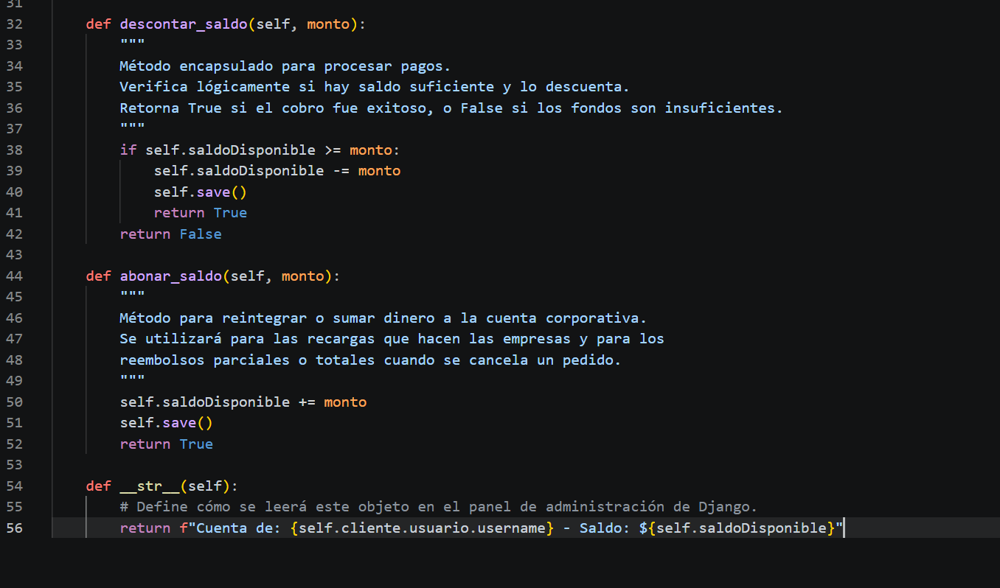

# Documento para ir detallando las correcciones que se le han hecho a lo que va de Backend.

---

## MODIFICACIONES:

### 1 --> Validación Estricta de Entradas en la Capa DTO / Serializers

**Se realiza esta corrección para cubrir la ISO/IEC 25010 (Adecuación Funcional y Seguridad, e integridad de datos)**

Actualmente en el Backend, los serializadores reciben datos sin comprobar restricciones de negocio en los valores numéricos ni en los formatos de identidad.

Se realizarán las siguientes validaciones:

1. **Validación de precios y cantidades:** Evitar que un usuario envíe cantidades iguales o menores a cero (cantidad <= 0) o precios alterados en el payload JSON.

2. **Validación de RUT chileno:** El campo rut en el modelo de usuario no debe recibir texto arbitrario; debe validarse mediante una función con algoritmo de dígito verificador (módulo 11) antes de persistirse.

3. **Validación de stock/disponibilidad previa:** En el serializador de pedidos, verificar no solo que el plato exista, sino que tenga el flag disponible=True activo antes de procesar el cobro.

